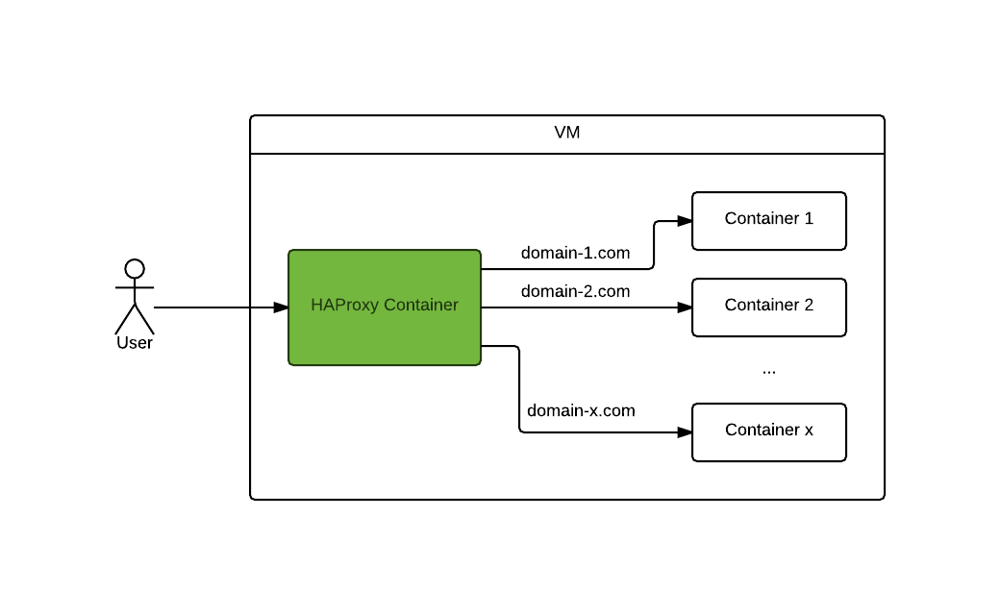
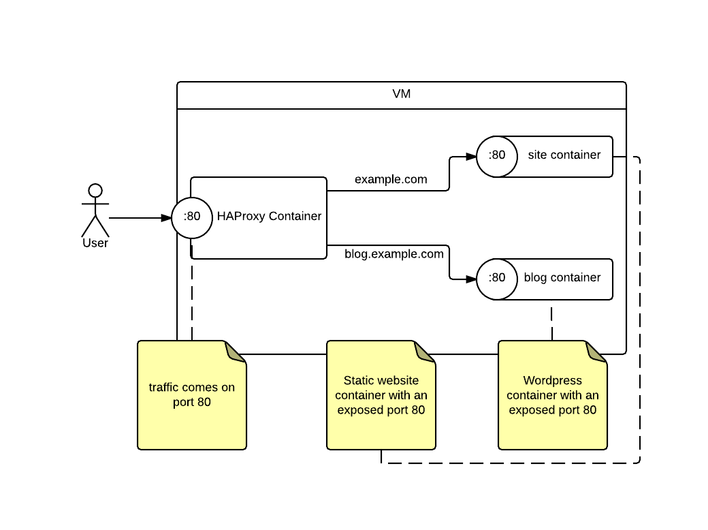

# HAProxy Domain Routing Docker Container

## What

What does this project do?

Example

## How

How does it work?

## HAProxy Configuration Generator

HAProxy Configuration Generator is the application which generates the `/etc/haproxy/haproxy.cfg` configuration file based on a `yaml` configuration.

### Requirements

- python
- [virtualenv](http://docs.python-guide.org/en/latest/dev/virtualenvs/), [pip](https://pypi.python.org/pypi/pip)

Required dependencies (on `Ubuntu`):

    sudo apt-get install python-dev libevent-dev -y

### Setup

    cd haproxy-config-generator-app
    virtualenv vendor
    source vendor/bin/activate
    pip install -r requirements.txt

> Note:
> To deactivate the virtual environment execute `deactivate` in Your termimnal

### Test

Install required packages:

    pip install -r requirements-test.txt

Run the test spec:

    nosetests

To see a sample configuration (`test/tmp/haproxy.cfg`) run:

    python app.py test

## Resources

- [Viewing HAProxy Statistics](http://www.networkinghowtos.com/howto/viewing-haproxy-statistics/)
- [HAProxy enable logging](http://webdevwonders.com/haproxy-load-balancer-setup-including-logging-on-debian/)
- [HAProxy Logging in Ubuntu Lucid](http://kvz.io/blog/2010/08/11/haproxy-logging/)
